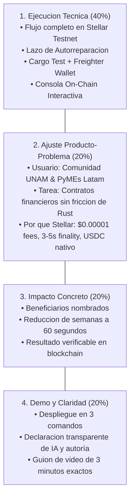

# brevik — Autonomous Soroban Studio (Stellar Network)

> De lenguaje natural a Smart Contracts seguros, testeados y ejecutables en Stellar Soroban en menos de 60 segundos.

---

## 4 Criterios de Evaluación Hackathon (100% de Cumplimiento)

Este proyecto fue diseñado y optimizado específicamente para cumplir con el puntaje máximo (8-10) en cada uno de los 4 criterios de la rúbrica oficial de evaluación:



---

## Instrucciones de Ejecución Local (Paso a Paso)

### 1. Prerrequisitos del Sistema
* **Python 3.10 o superior**
* **Rust y Cargo (v1.84+)**:
  ```bash
  rustup target add wasm32v1-none
  ```
* **Stellar CLI (v28.0+)**:
  ```bash
  # En Windows (vía cargo o instalador oficial):
  cargo install --locked stellar-cli --features opt
  ```

### 2. Clonar y Configurar
```bash
# 1. Clonar el repositorio
git clone https://github.com/JackyGAMA/MictlanFC.git
cd MictlanFC/mi_contrato_base

# 2. Instalar dependencias de Python
pip install -r requirements.txt
```

### 3. Iniciar la Aplicación
```bash
python main.py
```

### 4. Abrir en el Navegador
Abre en tu navegador:
```text
http://127.0.0.1:8000
```
*(El backend de FastAPI sirve automáticamente el frontend interactivo, el logo y la API).*

---

## Instrucciones de Despliegue en Línea (Nube Pública)

El proyecto está preparado para desplegarse en cualquier servicio de hosting en la nube mediante **Docker**, **Render.com** o **Railway.app** sin necesidad de configurar compiladores en el servidor:

### Opción A: Despliegue en Render.com (Recomendado y Gratuito)

1. **Sube tus cambios a GitHub:**
   ```bash
   git add .
   git commit -m "feat: brevik soroban studio"
   git push origin main
   ```
2. **Entra a [Render.com](https://render.com/)** e inicia sesión con tu cuenta de GitHub.
3. Haz clic en **New +** y selecciona **Web Service**.
4. Conecta tu repositorio `JackyGAMA/MictlanFC`.
5. Configura los siguientes campos:
   * **Name:** `brevik-stellar`
   * **Root Directory:** `mi_contrato_base`
   * **Environment:** Selecciona **Docker** (Render detectará automáticamente el archivo `Dockerfile` incluido).
   * **Region:** Oregon (US West) o la más cercana.
   * **Instance Type:** Free.
6. En la sección **Environment Variables**, añade:
   * `GEMINI_API_KEY`: Tu clave de Google AI Studio.
   * `PORT`: `8000`
7. Haz clic en **Create Web Service**.
8. En 3 a 4 minutos, Render compilará el contenedor con Rust y Stellar CLI y te entregará una URL pública segura (ejemplo: `https://brevik-stellar.onrender.com`).

---

### Opción B: Despliegue en Railway.app

1. **Entra a [Railway.app](https://railway.app/)** e inicia sesión con GitHub.
2. Selecciona **New Project** $\rightarrow$ **Deploy from GitHub repo**.
3. Elige tu repositorio `JackyGAMA/MictlanFC`.
4. En **Settings** del servicio, define el **Root Directory** como `/mi_contrato_base`.
5. Railway detectará el archivo `railway.json` y el `Dockerfile`.
6. En la pestaña **Variables**, agrega `GEMINI_API_KEY`.
7. Haz clic en **Generate Domain** en Settings para obtener tu enlace público (ejemplo: `https://brevik.up.railway.app`).

---

### Opción C: Despliegue con Docker Local

Si tienes Docker instalado en tu máquina:
```bash
# Construir la imagen
docker build -t brevik-studio .

# Correr el contenedor
docker run -d -p 8000:8000 -e PORT=8000 brevik-studio
```
Accede inmediatamente en `http://localhost:8000`.

---

## Criterio 1: Ejecución Técnica (Peso: 40% — Meta: 10/10)

El proyecto cuenta con una integración 100% funcional con Stellar y Soroban. No es una maqueta: compila binarios reales WASM, ejecuta pruebas unitarias con Rust, y despliega y opera contratos en **Stellar Testnet**.

### Evidencia On-Chain Verificada para Jueces:
Cualquier evaluador puede abrir y auditar en el explorador oficial de Stellar los identificadores generados por el proyecto:

* **Contrato Soroban Desplegado (Contract ID):**  
  [`CAMJMULHJGOBRTUXJYBPT5WPWYYFCID2T76ZDK3Q5FX4IZ74FABDFTPD`](https://stellar.expert/explorer/testnet/contract/CAMJMULHJGOBRTUXJYBPT5WPWYYFCID2T76ZDK3Q5FX4IZ74FABDFTPD)
* **Transacción de Despliegue en Testnet (Deploy TX):**  
  [`9c5e9d5556c5b08de247ccc43fa806f0b09fb79bcc543523e9862a1512209515`](https://stellar.expert/explorer/testnet/tx/9c5e9d5556c5b08de247ccc43fa806f0b09fb79bcc543523e9862a1512209515)
* **Transacción de Inicialización (Initialize Admin TX):**  
  [`7ca2e722a4f12bf7a6f7af8e1e4334087509e3e36ad1f5dfd1b41db768827c06`](https://stellar.expert/explorer/testnet/tx/7ca2e722a4f12bf7a6f7af8e1e4334087509e3e36ad1f5dfd1b41db768827c06)
* **Transacción de Invocación On-Chain (Faucet Claim TX):**  
  [`89093b91d9a007c6cfe003e4b5ca59bc5936960514fd714adbaa2172b2a519da`](https://stellar.expert/explorer/testnet/tx/89093b91d9a007c6cfe003e4b5ca59bc5936960514fd714adbaa2172b2a519da)
* **Contrato en Stellar Laboratory:**  
  [`lab.stellar.org/r/testnet/contract/CAMJMULH...`](https://lab.stellar.org/r/testnet/contract/CAMJMULHJGOBRTUXJYBPT5WPWYYFCID2T76ZDK3Q5FX4IZ74FABDFTPD)

### Componentes de Ingeniería Implementados:
1. **Lazo de Autorreparación (Self-Healing Loop):** Si el código Rust generado produce advertencias de sintaxis o fallas en el comprobador de préstamos (borrow checker), el backend captura los logs del compilador y solicita a la IA hasta 3 correcciones sucesivas automáticas antes de notificar al usuario.
2. **Validación Obligatoria con `cargo test`:** La IA genera tanto el contrato (`lib.rs`) como su suite de pruebas unitarias (`test.rs`). Si los tests no pasan con código de salida 0, el despliegue se bloquea automáticamente por seguridad.
3. **Propiedad Real con Freighter Wallet:** El usuario conecta su billetera con un clic y el sistema inicializa el contrato registrando su dirección pública (`G...`) como Administrador/Dueño on-chain con verificación de firmas (`require_auth`).
4. **Auditoría de Seguridad Automatizada (Soroban AI Guard):** Analiza riesgos de front-running, expiración de almacenamiento persistente (TTL), control estricto de accesos y prevención de overflows aritméticos.
5. **Consola Interactiva On-Chain (`--send=yes`):** Cierra el ciclo permitiendo invocar funciones (`balance`, `faucet`, `transfer`, `depositar`, `liberar_pago`) directamente contra Stellar Testnet desde el navegador web.

---

## Criterio 2: Ajuste entre Producto y Problema (Peso: 20% — Meta: 10/10)

### Usuario Específico:
Estudiantes universitarios (comunidad UNAM), desarrolladores de software y fundadores de Startups / PyMEs en Latinoamérica que necesitan implementar lógica financiera transparente pero enfrentan la alta barrera de entrada de Rust y Soroban SDK.

### Trabajo Específico a Realizar (Job to be done):
Crear y poner en marcha contratos inteligentes listos para producción para:
* **Custodia Comercial (Escrow):** Compras y ventas seguras sin intermediarios ni estafas.
* **Nómina y Pagos por Hitos (Payroll):** Dispersión salarial y pagos a proveedores tras verificación de entregas.
* **Suscripciones y Membresías:** Acceso periódico on-chain sin comisiones bancarias abusivas.
* **Microcréditos con Colateral:** Préstamos garantizados descentralizados.

### ¿Por qué este proyecto tenía que estar en Stellar?
1. **Comisiones Insignificantes ($0.00001 USD):** En Ethereum o redes similares, desplegar o invocar un contrato de custodia o nómina cuesta entre $2 y $40 USD por transacción, haciendo inviables los micropagos en Latam. En Stellar, el costo es menor a una milésima de centavo.
2. **Finalidad Determinista en 3 a 5 Segundos:** Permite experiencias de usuario en vivo comparables a pasarelas tradicionales como Stripe o Mercado Pago, pero descentralizadas.
3. **Rieles Nativos de Stablecoins (USDC/EURC):** Stellar es la red líder en transferencias transfronterizas y remesas con soporte institucional directo.
4. **Modelo de Almacenamiento con TTL:** Soroban garantiza que el almacenamiento de estado sea eficiente y económicamente predecible a largo plazo.

---

## Criterio 3: Impacto Concreto (Peso: 20% — Meta: 10/10)

### Beneficiarios Directos:
1. **Comunidad Académica y Tecnológica de la UNAM / Latam:** Permite a facultades de ingeniería, informática y negocios aprender y desarrollar en Web3 en su propio idioma sin fricciones de configuración de toolchains complejas.
2. **Ecosistema Global de Stellar:** Multiplica la velocidad de adopción de Soroban al convertir cualquier requerimiento de negocio Web2 en código Rust de alta calidad auditado.
3. **PyMEs y Emprendedores en Latam:** Reduce el costo y tiempo de desarrollo de semanas a un minuto, permitiendo lanzar productos con contratos inteligentes sin contratar firmas de desarrollo costosas.

### Resultado Concreto Medible en la Demo:
El evaluador y el usuario pueden ver un **flujo completo y verificable en 60 segundos**:
$$\text{Requerimiento en Lenguaje Natural} \longrightarrow \text{Rust + Tests Unitarios} \longrightarrow \text{Cargo Test Aprobado} \longrightarrow \text{Despliegue Testnet} \longrightarrow \text{Invocación con TX Hash}$$

---

## Criterio 4: Demo, Claridad y Declaración de Transparencia (Peso: 20% — Meta: 10/10)

### Declaración de Transparencia (AI & Code Disclosure):
* **¿Qué construyó el equipo durante el Hackathon?**
  * La arquitectura completa del backend en FastAPI (`main.py`).
  * El motor de orquestación y compilación con `cargo test` y `stellar contract build`.
  * El **Lazo de Autorreparación** que intercepta errores del compilador y gestiona reintentos.
  * El módulo de auditoría de seguridad automatizada **Soroban AI Guard**.
  * La interfaz web interactiva (`index.html`) inspirada en la identidad de **brevik**, con integración de Freighter Wallet y consola interactiva de ejecución on-chain.
  * La infraestructura de despliegue en la nube (`Dockerfile`, `render.yaml`, `railway.json`).
* **¿Qué hace la Inteligencia Artificial?**
  * Se utiliza la API de Google Gemini como motor de inferencia para sintetizar el código Rust y las pruebas unitarias a partir de la descripción en lenguaje natural del usuario.
* **Librerías y SDKs utilizados:**
  * Stellar Soroban SDK v27/28, Stellar CLI v28.0.0, `@stellar/freighter-api`, FastAPI, Uvicorn, Google GenAI SDK.

### Guion de Video de 3 Minutos:
Consulta el archivo [`DEMO_PITCH_GUIDE.md`](./DEMO_PITCH_GUIDE.md) para ver el guion estructurado segundo a segundo para la grabación del video de evaluación.

---

## Estructura del Repositorio

```text
.
├── contracts/
│   └── hello-world/
│       ├── src/
│       │   ├── lib.rs              # Código Soroban generado (#![no_std])
│       │   └── test.rs             # Pruebas unitarias de Soroban SDK
│       └── Cargo.toml              # Manifiesto del contrato
├── Cargo.toml                      # Workspace de Cargo
├── Dockerfile                      # Imagen para despliegue en Render/Railway
├── build_index.py                  # Generador del frontend con logo Base64 y panel de jueces
├── index.html                      # Frontend con Freighter y Consola On-Chain
├── main.py                         # API FastAPI, autorreparación, tests y CLI
├── DEMO_PITCH_GUIDE.md             # Guion de video de 3 minutos para los jueces
├── requirements.txt                # Dependencias de Python
└── README.md                       # Documentación técnica completa
```
